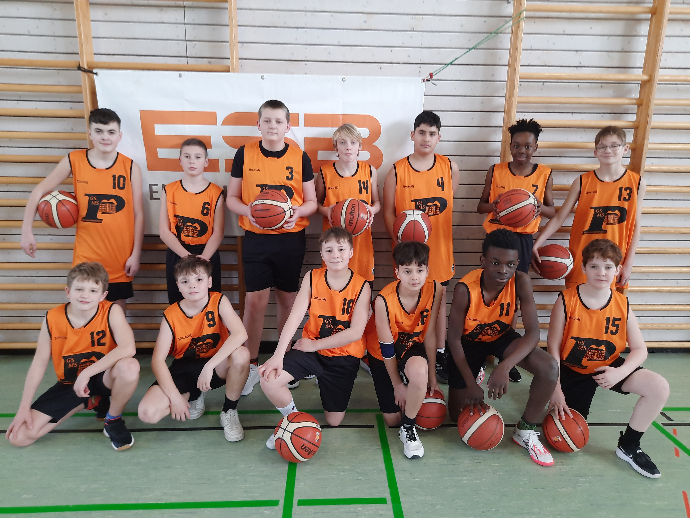

+++
title = "Jahrgänge 2013 und jünger mit viel Begeisterung am Ball"
date = 2026-03-06
description = "Die jungen Basketballer der Bürgermeister-Schütte-Mittelschule zeigten beim Regionalentscheid in Murnau großen Einsatz und Leidenschaft."
[taxonomies]
tags = ["Aktuelles", "Basketball", "Jugend trainiert für Olympia", "Sport", "Schule"]
categories = ["Sport & Gesundheit"]
+++

Es sind die Jahrgänge 2013 und jünger, die ihren Sportlehrern viel Freude bereiten. Dies zeigt sich auch besonders deutlich, wenn es um die Teilnahme an den Wettkämpfen „Jugend trainiert für Olympia geht".

<!-- more -->

Auch wenn meist Niederlagen eingesteckt werden müssen, so ist die Beteiligung und „Anmeldung" in diesen Jahrgängen für Schulmannschaften bis dato ungebremst — die Schüler geben ihr Bestes. Sie spielen fair und vertreten ihre Schule würdig.

## Basketball-Wettkampf in Murnau

Nach den Wettkämpfen Fußball, Handball und Tischtennis durften endlich auch die jungen Basketballer der Bürgermeister-Schütte-Mittelschule am 25.02.2026 ihr Können zeigen.

Mit der Bahn reiste Sportlehrer Christian mit seinen Schützlingen vormittags ins Zentrum des Blauen Landes nach Murnau, um gegen das örtliche Gymnasium um den Einzug in den Regionalentscheid in der Sportart Basketball zu kämpfen.

Auf Grund der hohen Schülernachfrage bzgl. Teilnahme am Basketballwettbewerb beider beteiligten Schulen konnten jeweils zwei Teams der selben Altersklasse eingesetzt werden. Der Vorteil: genügend Spielzeit für alle Schüler und Einteilung nach Leistungsniveau — wobei bei Murnau keine Unterschiede zu erkennen waren.

## Die Spiele

**Team I** schlug sich wacker. Die beiden Vereinsspieler Kenan Nazifoglou (4) und Nikolaos Ventouris (6) bereicherten durch ihre Spielweise das Partenkirchener Spiel, und so verlor man nur 28:20.

**Team II** war zwar bemüht und versuchte ihr Bestes, doch hier machte sich das Fehlen von „Profis" deutlich bemerkbar. Mit 37:6 wurden sie in ihre Schranken verwiesen. Auffälligster Spieler im Team II war der vereinslose Lucas Frey (14). Er rackerte von Beginn an, war wieselflink und hoch motiviert. Doch gegen erfahrene Vereinsspieler hatte er keine Chance. Schade, dass er und viele weitere Talente sich bisher noch keinem Verein angeschlossen haben — ihr Sportlehrer würde es sehr begrüßen.

## Fazit

Alle Mittelschüler konnten trotz der Niederlage(n) sich an ihren Spielminuten erfreuen und viel Basketballerfahrung mit in den Schulsport nehmen.

---

**Mannschaft:**

*Stehend:* Alex Miller, Nikolaos Ventouris, Marcel Witowski, Lucas Frey, Kenan Nazifoglou, Praise Osas, Max Gerhold

*Sitzend:* Luan Rotter, Samuel Parilla, Metin Glöckner, Ares, Noel Ndonga, David Jonescu
