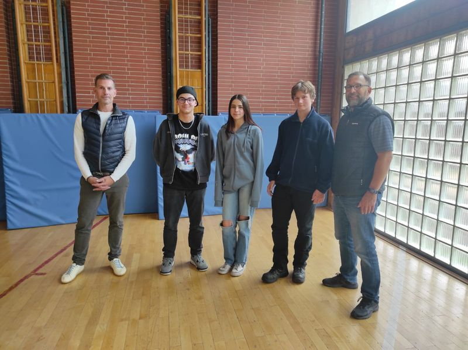

+++
title = "👍 Voller Einsatz für Mitschülerinnen und Mitschüler"
date = 2022-10-18
[taxonomies]
tags = ["aktuelles" ,"ministerien-infos" ,"presse" ]
+++

Garmisch-Partenkirchen/Landkreis.

Robert Rauch, Alikerim Cetin, Lilli Bader Peter Sedlmayr, Kurt Christian

Sich austauschen, miteinander diskutieren,  
Projektideen entwickeln und umsetzen – all das ist das Fundament einer  
funktionierenden Schülermitverantwortung (SMV) an allen bayerischen Schulen. Dabei  
engagieren sich die Schüler- und Landkreisschülersprecher der Mittelschulen im  
Landkreis mit ihren jeweiligen Verbindungslehrkräften für ein demokratisches, aktives  
und werteorientiertes gemeinsames Schulleben. Kürzlich trafen sich die neu gewählten  
Schülersprecher aller sieben Mittelschulen des Landkreises Garmisch-Partenkirchen  
und ihre jeweiligen Verbindungslehrkräfte mit den beiden SMV-Landkreiskoordinatoren  
Kurt Christian und Robert Rauch (beide Lehrkräfte an der BGM-Schütte-Mittelschule  
Garmisch-Pa.), um sich näher kennenzulernen und sich auszutauschen. Da das  
Wetter dieses Jahr nicht mitspielte, verlagerten die Teilnehmer ihre team- und  
vertrauensbildenden Aktionen kurzerhand in die Sporthalle der Mittelschule am Gröben  
in Garmisch-Pa.. Diese Umstände hielten die Schülervertreter aber nicht davon ab,  
intensiv und motiviert miteinander zu diskutieren. So haben die Schülervertreter im  
Rahmen der SMV die Möglichkeit das Schulleben an ihrer Schule aktiv mitzugestalten,  
beispielsweise bei der Durchführung gemeinsamer Veranstaltungen, bei der  
Wahrnehmung schulischer Interessen der Schüler und auch bei der Lösung von  
Konfliktfällen. Aus ihrer Mitte heraus wurden zum Abschluss der Veranstaltung dann  
noch die Landkreisschülersprecher für die nächsten beiden Schuljahre bestimmt. Zum  
Landkreisschülersprecher wurde dabei Alikerim Cetin, der Christoph-ProbstMittelschule Murnau besucht, gewählt. Ihm zur Seite stehen als Stellvertreter Lilli  
Bader und Peter Sedlmayr, die beide die BGM-Schütte-Mittelschule Garmisch-Pa.  
besuchen.  
Alle Schülersprecherinnen und Schülersprecher sowie alle Verbindungslehrkräfte  
wünschten abschließend den drei neuen Landkreisschülersprechern, die nun die  
Interessen von insgesamt 1.000 Schülerinnen und Schülern der Mittelschulen  
vertreten, viel Erfolg in ihrem neuen Aufgabenbereich.  
Bildbeschreibung v.l.n.r.:

[Zeitungsbericht vom 14.10.22](https://volksschule-partenkirchen.de/wp-content/uploads/Zeitungsbericht-v.-14.10.22.pdf)[Herunterladen](https://volksschule-partenkirchen.de/wp-content/uploads/Zeitungsbericht-v.-14.10.22.pdf)

[Landkreisschuelersprecher 2022\_23](https://volksschule-partenkirchen.de/wp-content/uploads/PM-Landkreisschuelersprecher-2022_23.pdf)[Herunterladen](https://volksschule-partenkirchen.de/wp-content/uploads/PM-Landkreisschuelersprecher-2022_23.pdf)
