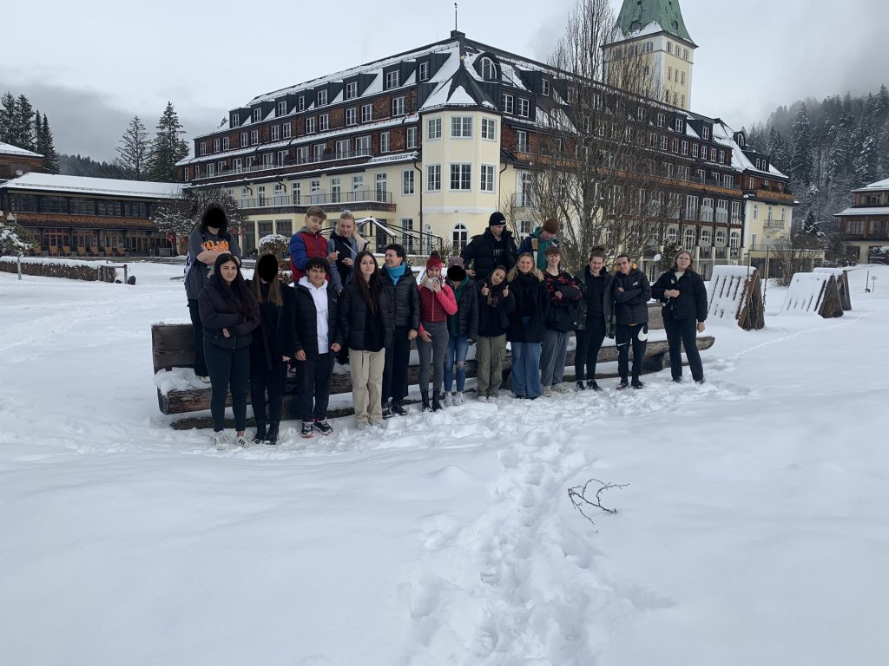

+++
title = "🏰 Berufsorientierung mal ganz anders"
date = 2023-01-29
[taxonomies]
tags = ["aktuelles" ,"berufsorientierung" ]
+++

**Berufsorientierung mal ganz anders – Betriebserkundung der 10Ma im Schlosshotel Elmau**

Noch vor Weihnachten kam die Zusage der Personalleiterin Frau J. Kördel, dass wir das Schlosshotel Elmau, bekannt vom G7 Gipfel in den Jahren 2015 und 2022, besuchen dürfen, um einen Einblick in die Arbeitswelt eines Hotels zu bekommen.

<!-- more -->

Nach vielen sehr interessanten Informationen zur Geschichte des Hotels, wurden wir durch die unterschiedlichen Bereiche des Schlosses geführt. Wir erhielten einen Einblick in die Struktur des Betriebes und in das Arbeitsleben in der Hotelbranche. Frau Kördel informierte uns dabei über die vielfältigen Ausbildungsmöglichkeiten im Hotel und beantwortete unsere Fragen mit viel Geduld. Wir erfuhren zudem, dass ein einwöchiges Schülerpraktikum in verschiedenen Bereichen des Hauses jederzeit absolviert werden kann.

Die Klasse 10 Ma verließ das Hotel mit großer Begeisterung, bleibenden Eindrücken und mehreren Ausbildungs- und Praktikumswünschen.

**_„Eine Ausbildung in einem der besten Hotels der Welt, kann eine Schule für das Leben sein, in der Sie nicht nur die hohe Kunst der Gastfreundschaft erlernen, sondern vor allem auch Ihre Talente, Persönlichkeit und Fähigkeiten im Umgang mit anderen Menschen entwickeln können.“_** _(Azubibroschüre, Schloss Elmau)_

