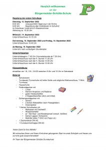

+++
title = "Materialliste und Regelung für die ersten Schultage"
date = 2023-05-19
[taxonomies]
tags = ["Infos zum Schulanfang", "Materialien" ]
klassen = ["1. Klasse"]
+++

<!-- more -->

# Regelung der ersten Schultage
**Dienstag, 12. September 2023**  
8.00 Uhr voraussichtlich Segnung in der Kirche  
9.00 Uhr Begrüßung aller Erstklässler im Schulhof im Anschluss: Unterricht im Klassenzimmer  
Abholung ca. 10.30 Uhr  
**Mittwoch, 13. September 2023**  
Unterrichtsschluss 10.15 Uhr  
**Donnerstag, 14. September 2023 und Freitag, 15. September 2023**  
Unterrichtsschluss 10.45 Uhr  
ab Montag, 18. September 2023 Unterricht nach vorläufigem Stundenplan  

**Unterrichtszeiten**  
Unterrichtsbeginn 7.45 Uhr (Vorviertelstunde ab 7.30 Uhr)      
Unterrichtsschluss nach der 4. Stunde 11.00 Uhr  
Unterrichtsschluss nach der 5. Stunde 12.00 Uhr  
Unterrichtsschluss nach der 6. Stunde 12.45 Uhr  

Weitere Informationen finden Sie im angehängten Dokument:
{{downloads(folder="downloads/")}} 
