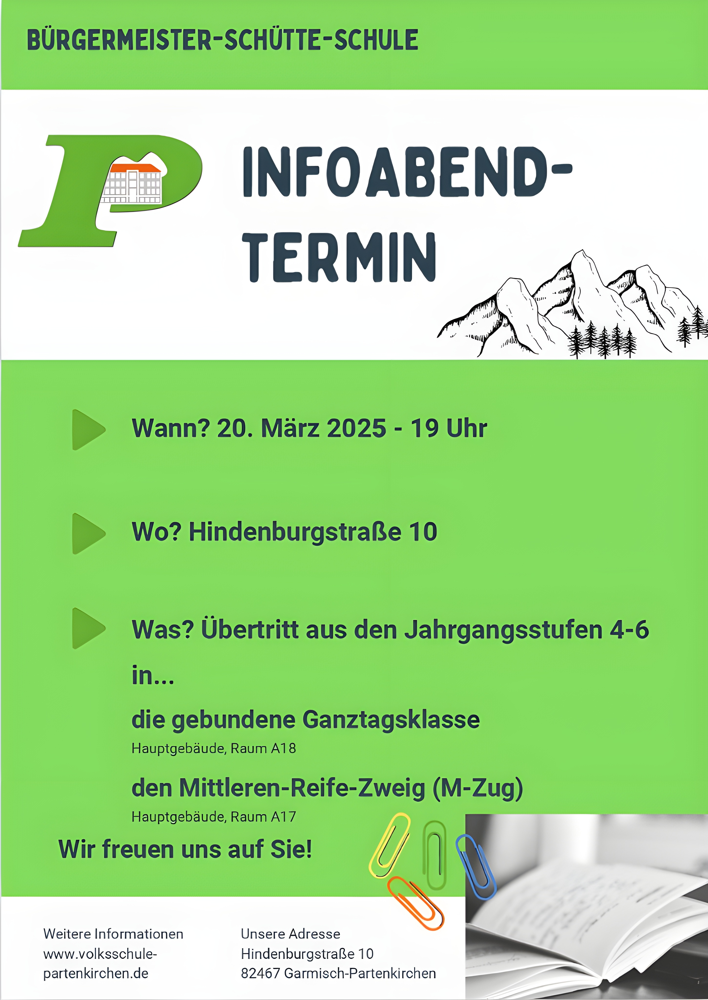

+++
weight = 1
date = "2025-02-26"
title = "Infoabend"
template = "page.html"
description ="Infoabend-Termin"
[taxonomies]
tags = [ "Aktuelles" , "Mitteilungen"]
[extra]
notification = "2025-03-20"
+++

<!-- more -->

