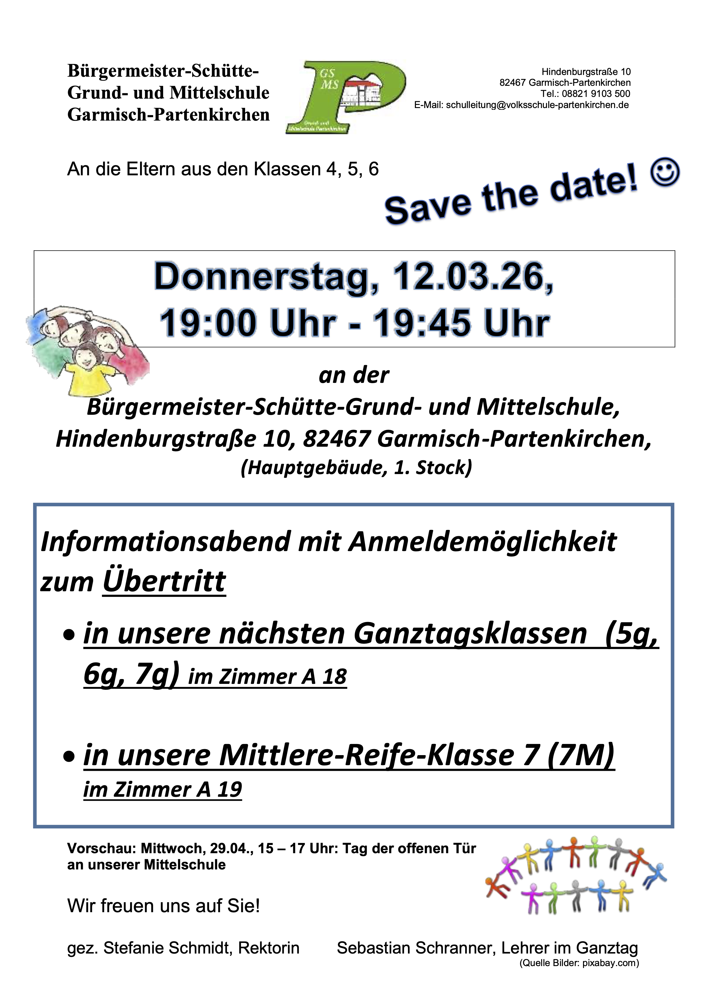

+++
weight = 1
date = "2026-03-06"
title = "Informationsabend"
template = "page.html"
description ="mit Anmeldemöglichkeit zum Übertritt"
draft = true
[taxonomies]
tags = [ "Aktuelles" , "Mitteilungen"]

[extra]
notification = "2026-03-13"
+++

<!-- more -->

{{downloads(folder="downloads")}}