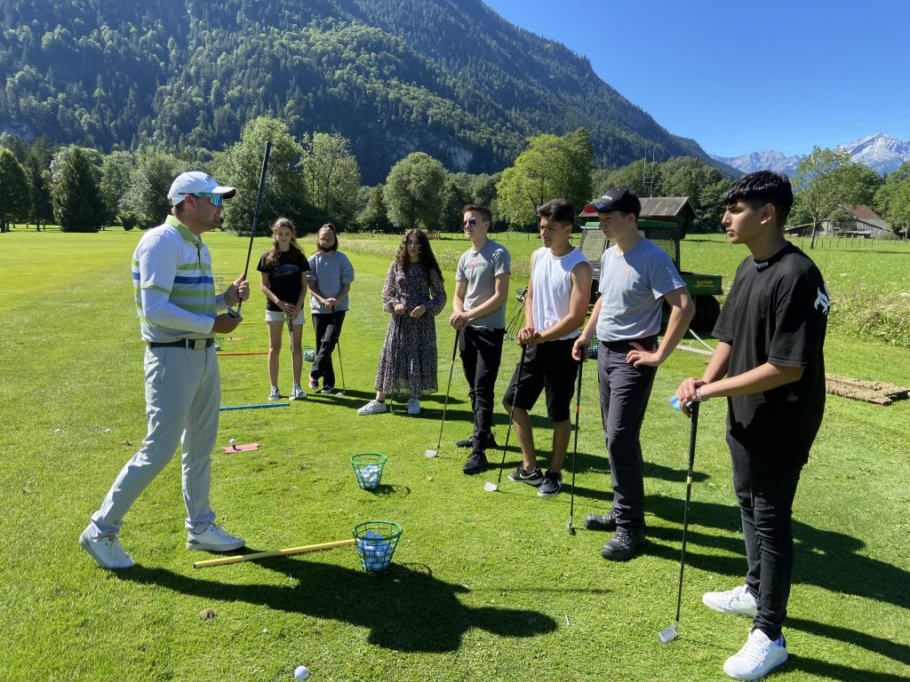

"Golferluft" für MittelschülerInnen

_„Abschlag Schule“ – lautete die Projektinitiative des Deutschen Golf Verbandes._

_„Du verlierst nie. Entweder du gewinnst oder du lernst!“ – anhand dieses Mottos versucht die 2. Konrektorin Sonja Ermer ihren Mittelschülern der Bürgermeister-Schütte-Schule Garmisch-Partenkirchen ein breites Spektrum an Sportarten näher kommen zu lassen._

So bekam die Klasse 8a die Möglichkeit, einen professionellen Unterricht im Golfclub Garmisch-Partenkirchen zu absolvieren.

Die Golflehrer Kathrin und Johannes Perschke vermittelten die neue Sportart auf einer humorvollen, animierenden und schülerorientierten Art, sodass die Jugendlichen in kurzer Zeit persönliche Erfolge erleben durften.

Sogar ein „Hole-in-one“ gelang einer Schülerin!

Dank der finanziellen Unterstützung des Deutschen Golf Verbandes konnten die Schüler vom Abschlag bis zum Putten alles unter Aufsicht der Trainer üben.

Am Ende dieses Moduls waren sich alle Beteiligten einig – eine Wiederholung muss unbedingt im nächsten Schuljahr stattfinden.
