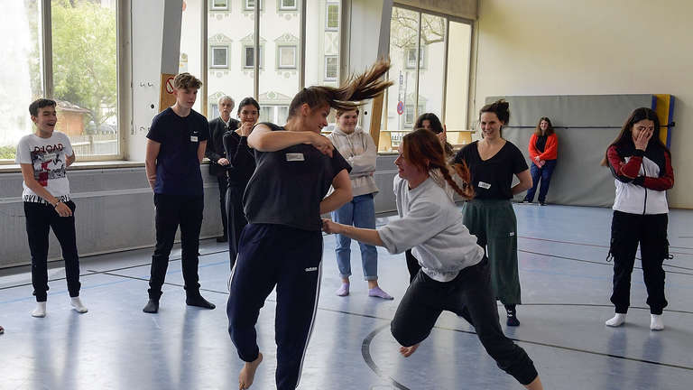

© FOTOPRESS THOMAS SEHR

[_GAP – „Jungen Leuten zeigen was in ihnen steckt“, bringt Tanzkünstlerin Ellen Steinmüller es auf den Punkt. Dass ist das Ziel des Projektes „Alpensinfonie - ein Tanzprojekt“, welches vom Kiwanis-Club Garmisch-Partenkirchen initiiert wurd_e.>>](https://www.merkur.de/lokales/garmisch-partenkirchen/kreisbote/tanz-auf-die-alpensinfonie-im-rahmen-der-strauss-tage-treten-schuelerinnen-und-schueler-auf-91548517.html)

[Zeitungsbericht-v.-16.05.22-Tanzprojekt](https://volksschule-partenkirchen.de/wp-content/uploads/Zeitungsbericht-v.-16.05.22-Tanzprojekt-1-2.pdf)[Herunterladen](https://volksschule-partenkirchen.de/wp-content/uploads/Zeitungsbericht-v.-16.05.22-Tanzprojekt-1-2.pdf)

[Zeitungsbericht-v.-25.05.22-Tanzprojekt](https://volksschule-partenkirchen.de/wp-content/uploads/Alpensinfonie-Kreisbote-25.05.22.pdf)[Herunterladen](https://volksschule-partenkirchen.de/wp-content/uploads/Alpensinfonie-Kreisbote-25.05.22.pdf)
