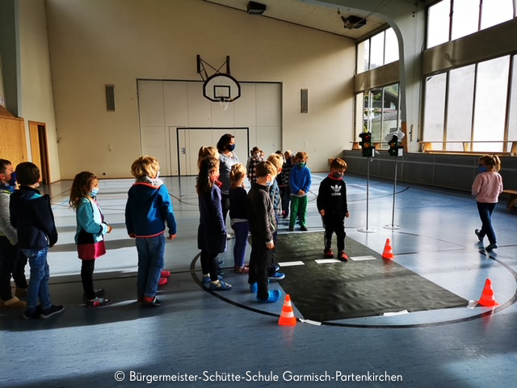
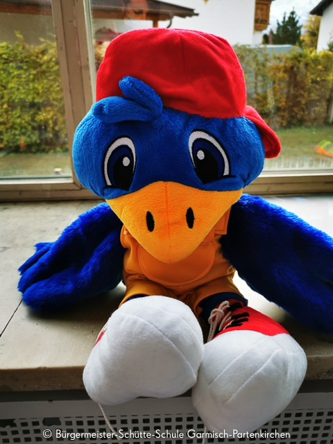

Im Oktober durften die vier ersten Klassen unserer Schule in der Turnhalle ein Training zur Sicherheit im Straßenverkehr durchführen.  
Das Programm "Aufgepasst mit ADACUS" führt junge Verkehrsteilnehmer spielerisch an ihre Rolle als Fußgänger heran. Wichtige Verhaltensregeln werden erläutert und aktiv eingeübt. Dabei werden persönliche Erfahrungen der Kinder aufgegriffen.  
In dem rund 45-minütigem Programm vermittelte eine speziell ausgebildete ADAC-Moderatorin kindgerecht wichtige Sicherheitsaspekte. So wurde beispielsweise das sichere Überqueren an einer Ampel intensiv eingeübt.

- 
    
- 
    

Damit der Spaß nicht zu kurz kommt, führte der Kinderliebling "ADACUS", eine wissbegierige Puppe, durch das Programm.  
Die Kinder waren mit Begeisterung bei der Sache und trainierten wichtige Verhaltensregeln im Straßenverkehr.
