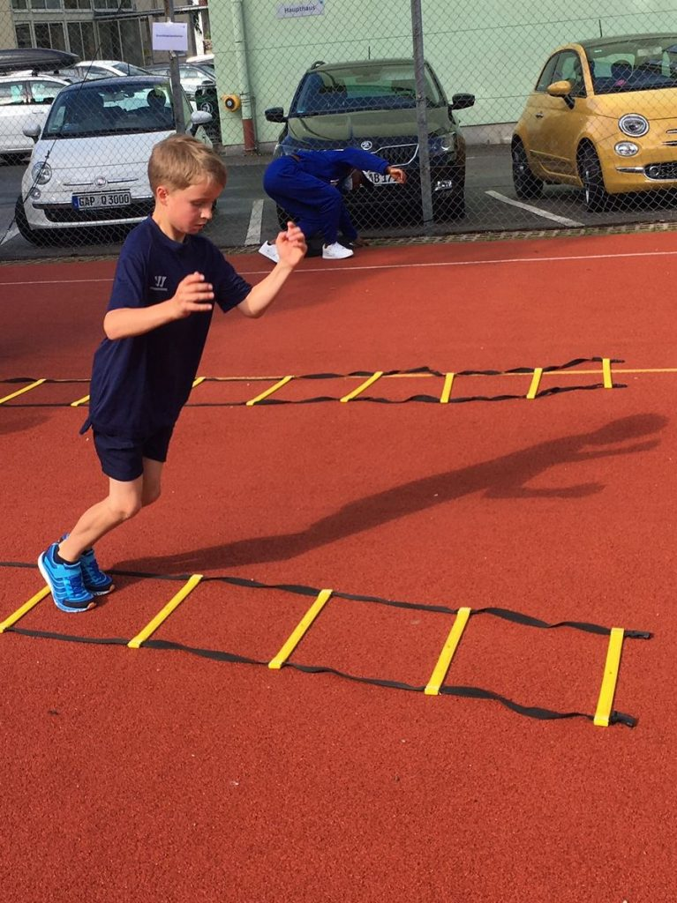
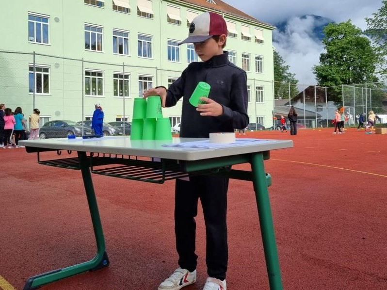
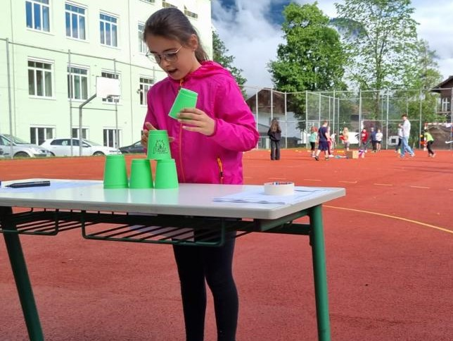
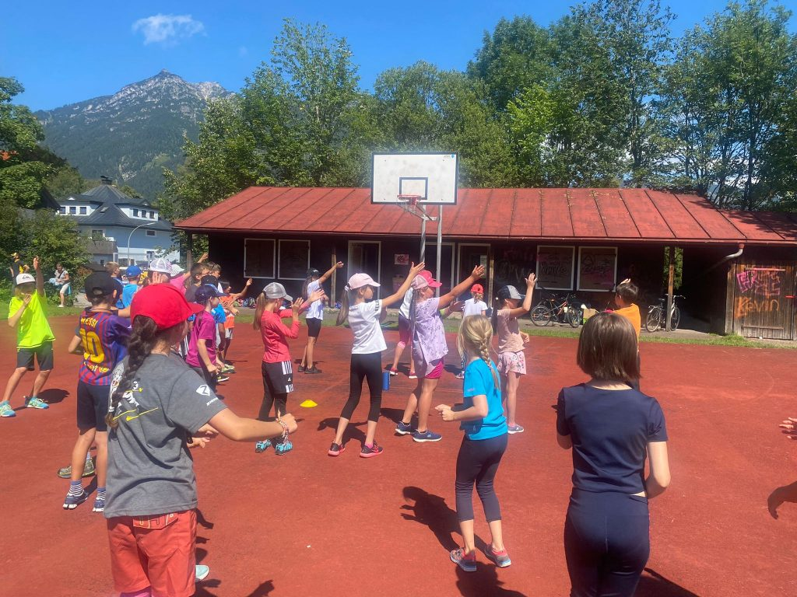

Am Montag, den 11.07.2022 fanden die Bundesjugendspiele für unsere Grundschule am Zerhoch-Sportplatz statt. Zum bewegten Start in den Tag tanzten alle Kinder gemeinsam einen Flashmob. Danach zeigten die Schüler_innen ihr Können beim 50 m Lauf, Weitsprung und Weitwurf. Zwischen den einzelnen Disziplinen konnten die Kinder mit Geräten aus der „fit4future“-Tonne spielen und gemeinsam Spielformen entwickeln, sowie ihr sportliches Geschick testen. Ein herzliches Dankeschön geht an dieser Stelle an die zahlreichen Helfer der zehnten Klassen, an das Team an Kolleg_innen, das in vielfältigen Funktionen mitgewirkt hat und an die unterstützenden Eltern. Zudem geht ein großes Lob an alle Kinder, die hoch motiviert am Sportfest teilgenommen und sehr gute Leistungen erzielt haben.

Anja Schalkhäuser-Riesch, Max Tauwald und Monika Pach

