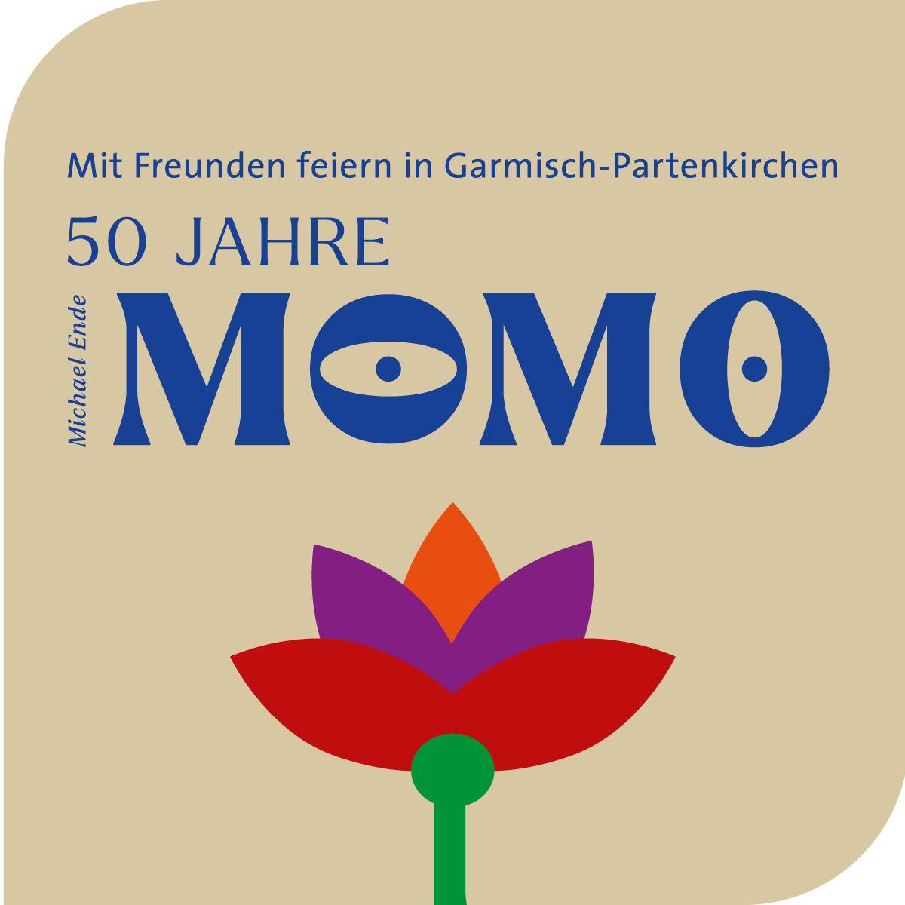
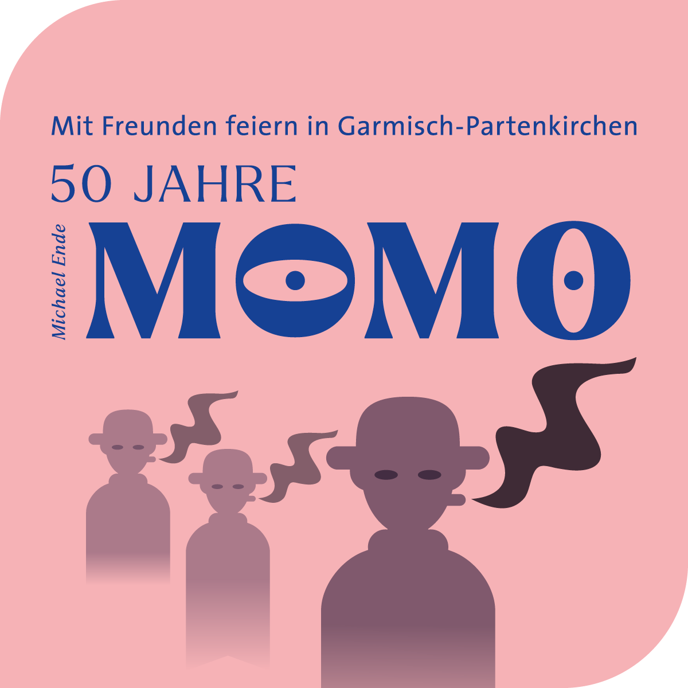

## 26\. März 2023, 11:30 Uhr  
Momo

→ Kinder 8 €, Erwachsene 10 €

→ FSK ab 6 Jahre

→ DE, IT 1985, R: Johannes Schaaf, 104 Min, D: Radost Bokel,  
Mario Adorf u. a.

Im Anschluss an den Hauptfilm ist das Tanzprojekt, das Motive aus Momo verwendet und poetisch auslegt, zu sehen (Länge ca. 30 Minuten). Dieses entstand zusammen mit Schüler\*innen der Bürgermeister-Schütte-Grund- und Mittelschule im Rahmen von GAP.beinand 2021, war zunächst als Bühnenstück geplant und wird nun das erste Mal im Kino aufgeführt.

[Hier gehts zum Programm](https://buergerservice.gapa.de/programm-1-quartal/)

