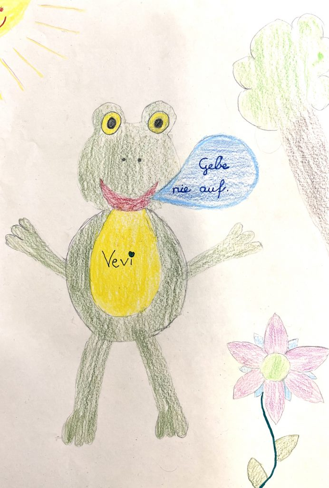
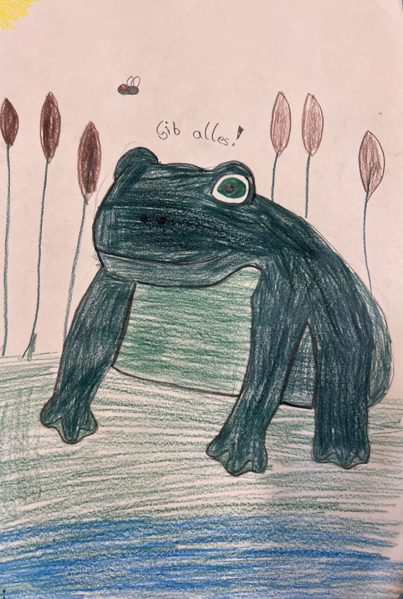
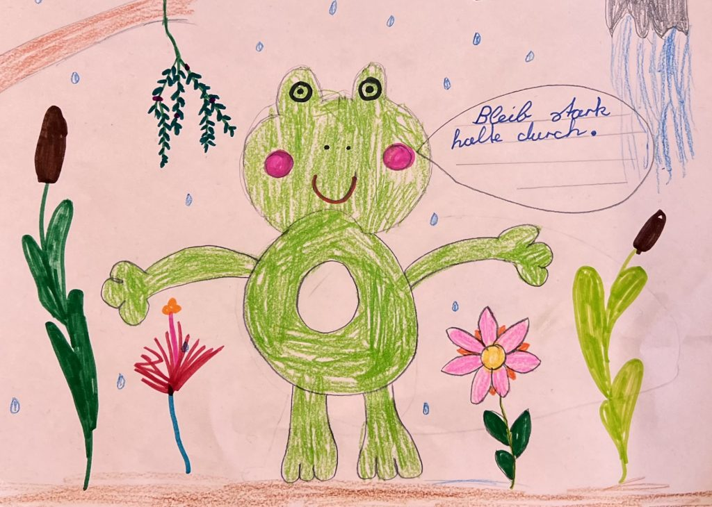
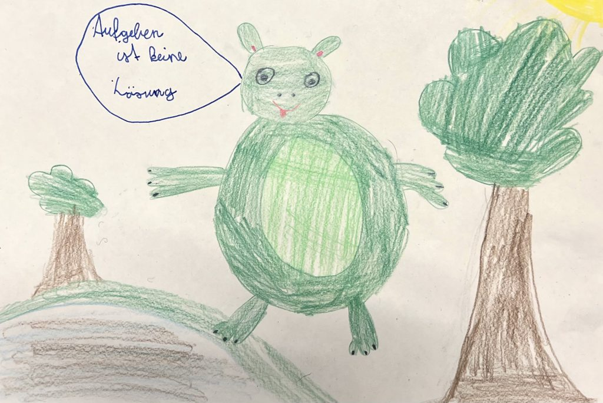
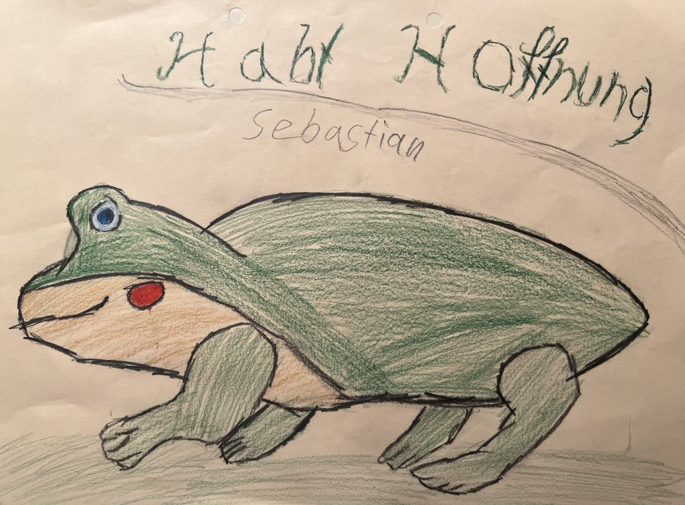

Eines Tages trocknete die Sommerhitze einen Tümpel aus,  
in dem zwei Frösche lebten. Als alles Wasser verdunstet war, mussten sie den Tümpel verlassen. Doch so weit die beiden Frösche auch wanderten, sie fanden keinen Bach und keinen Teich. Halb verdurstet entdeckten sie in der Speisekammer eines Bauernhofs einen Krug voll frischer fetter Milch.  
Die Frösche konnten ihr Glück kaum fassen und hüpften sogleich hinein. Sie tranken und schmatzten, bis sie nicht mehr durstig waren.  
Als sie wieder herauswollten, schwammen sie zum Rand des Kruges. Doch der Rand hatte sich zu weit entfernt und sie rutschen an der glatten Wand immer wieder ab.  
Sie strampelten viele Stunden lang, aber alle Mühen schienen vergeblich.  
Schließlich waren sie so erschöpft, dass sie ihre Beine kaum noch bewegen konnten.  
Da meinte der eine Frosch: „Was hilft es, wenn wir uns plagen. Es ist aus!“ Damit ließ er sich zu Boden sinken und gab auf.  
Der zweite Frosch gab jedoch die Hoffnung nicht auf.  
Er schwamm und strampelte die ganze Nacht weiter.  
Als es endlich Morgen wurde und die Sonne in die Kammer schien, saß der Frosch auf einem Butterklumpen.  
Er nahm all seine Kraft zusammen, sprang aus dem Krug und war gerettet. 

